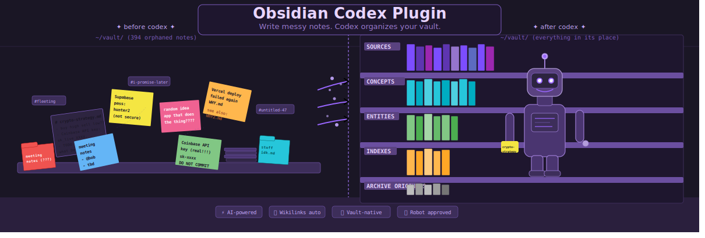
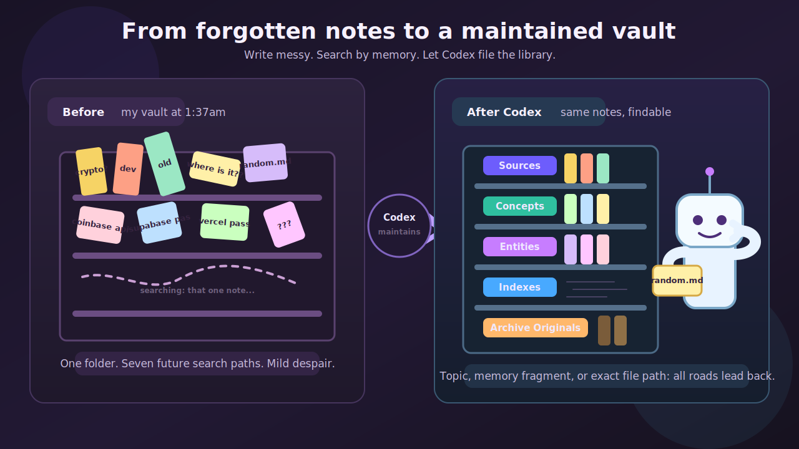
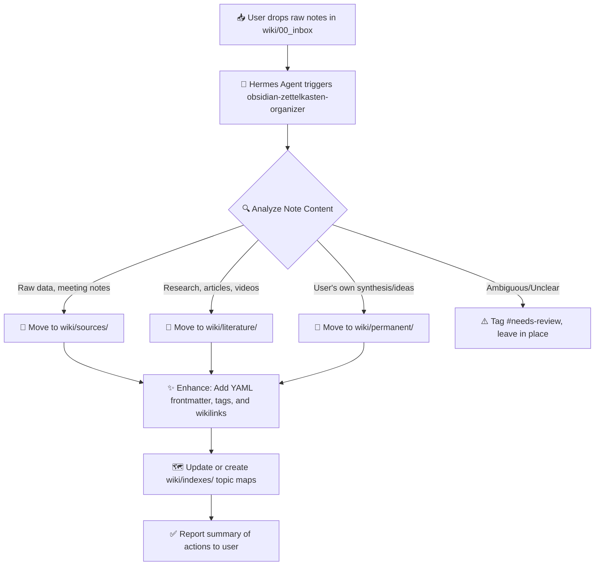

# Obsidian Codex Plugin



Let Codex maintain your Obsidian vault.

Write notes however you naturally write them: in project folders, daily notes, topic folders, scratch files, or old forgotten corners of the vault. Codex scans the vault, organizes messy notes into linked wiki pages, keeps exact source provenance, and preserves processed originals in `wiki/archive/originals/`.

> Educational project notice: this project is experimental software for learning, research, and personal knowledge-management workflows. It is provided as-is under Apache-2.0. You are responsible for how you use it, the notes you ingest, and any decisions you make from generated wiki content.

## Write Anywhere, Let Codex Maintain

Use the vault like a real working library, not a filing bureaucracy:

1. Write notes anywhere in your Obsidian vault.
   Keep using the folders and habits you already have. Rough notes, call notes, snippets, reminders, ideas, drafts, and unfinished fragments do not need a special drop zone.
2. Keep active context in `wiki/hot.md`.
   Use this as the compact "what am I working on now?" page that Codex can refresh after setup, ingest, query, or lint work.
3. Let Codex organize the whole vault.
   Codex can split mixed notes into source summaries, literature notes, permanent notes, entities, concepts, and index pages.
4. Preserve originals in `wiki/archive/originals/`.
   Messy capture notes are archived after they have been safely represented elsewhere. The original is not deleted automatically.
5. Build maps of knowledge in `wiki/indexes/`.
   Create topic maps and navigation pages for areas like AI, health, business ideas, projects, or anything else you want to think about over time.

Folders are storage. Wikilinks, index pages, entities, concepts, aliases, and retrieval cues are the source of truth.



## Demo

After ingesting 50 mixed sample Markdown files, Obsidian graph view starts to show a linked working-memory layer:


## Why This Exists

Large language model sessions are powerful, but they forget context unless you give them a durable place to write. Obsidian is a natural home for that context because it is local-first, Markdown-based, graph-friendly, and pleasant to inspect manually.

This clean-room Codex-native plugin helps Codex act like a wiki maintainer:

- `wiki/hot.md` stores the latest active working context.
- whole-vault retrieval helps find old notes by topic or memory fragment, even when they live outside `wiki/`.
- `wiki/sources/` stores maintained source summaries.
- `wiki/archive/originals/` preserves messy original notes after organization.
- `wiki/literature/`, `wiki/permanent/`, and `wiki/indexes/` support the zettelkasten path from source notes to durable ideas and topic maps.
- Other modes can also create folders such as `wiki/concepts/`, `wiki/entities/`, `wiki/questions/`, `wiki/maps/`, or PARA folders.
- `.raw/` tracks ingested source files when Codex imports external Markdown.
- `.vault-meta/retrieval-index.json` helps Codex find relevant pages before answering.

The result is not just a pile of Markdown. It is a local knowledge graph that can start messy, become more organized over time, and remain readable in Obsidian.

## Inspiration And Attribution

This project is inspired by the public LLM wiki workflow and the MIT-licensed [`AgriciDaniel/claude-obsidian`](https://github.com/AgriciDaniel/claude-obsidian) project.

This repository is a clean-room Codex-native implementation:

- It does not copy upstream GPL CSS snippets.
- It does not bundle Obsidian community plugin binaries.
- It uses filesystem-first helpers designed for Codex plugin workflows.
- Optional REST, MCP, and Obsidian CLI transport detection is metadata only unless explicitly used.

## What It Does

- Sets up a ready-to-open Obsidian vault.
- Creates `wiki/archive/originals/` to preserve processed original notes.
- Leads naturally with `zettelkasten` mode while still supporting `generic`, `lyt`, and `para` modes.
- Ingests Markdown/text sources into linked wiki pages.
- Builds a lightweight whole-vault retrieval index for cited answers.
- Lints the vault for dead links, missing frontmatter, orphans, duplicate titles, weak source attribution, and stale hot cache.
- Saves conversations into the wiki.
- Creates Obsidian canvas files and dashboard metadata.
- Preserves existing vault notes when bootstrapping into an existing vault.

## Quick Start

### 1. Install the Codex plugin locally

From the plugin source folder:

```powershell
codex plugin add obsidian-codex-plugin@personal
```

Start a new Codex thread after installing or refreshing the plugin so the skills are loaded.

### 2. Set up a test vault

Ask Codex:

```text
Set up an Obsidian wiki vault at C:\path\to\Test_Vault using zettelkasten mode.
```

Or run the helper directly:

```powershell
.\bin\setup-vault.ps1 C:\path\to\Test_Vault zettelkasten
```

### 3. Open the vault in Obsidian

In Obsidian:

```text
Manage vaults -> Open folder as vault
```

Open:

```text
C:\path\to\Test_Vault
```

### 4. Organize notes or ingest sample Markdown files

For your own notes, ask Codex to maintain the vault you already use:

```text
Maintain and organize my Obsidian vault at C:\path\to\Test_Vault.
```

For external sample data, ask Codex:

```text
Ingest all Markdown files from C:\path\to\Test_Data into my Obsidian wiki at C:\path\to\Test_Vault.
```

After ingesting 50 files, a healthy test vault should look roughly like:

```text
wiki/sources: 50 source pages
wiki/archive/originals: preserved originals when messy notes are organized
.raw/.manifest.json: 50 tracked source entries
retrieval index: refreshed across the vault
zettelkasten folders: wiki/literature, wiki/permanent, wiki/indexes
lint: no blocker/high/medium/low findings
hot cache: points to the latest ingest
```

## Example Codex Prompts

Maintain and organize the vault:

```text
Maintain my Obsidian vault at C:\path\to\Test_Vault. Split messy notes, update indexes, and archive originals.
```

Query the wiki with citations:

```text
Query my Obsidian wiki at C:\path\to\Test_Vault about finance themes with citations.
```

Find cross-topic connections:

```text
Find connections between travel planning, budgeting, and personal routines in my wiki.
```

Create a visual canvas:

```text
Create a canvas called Test Data Map grouping the ingested notes into development, travel, finance, and personal life.
```

Save a useful conversation:

```text
Save this conversation to my Obsidian wiki as "Plugin Launch Notes".
```

Run a health check:

```text
Lint my Obsidian wiki at C:\path\to\Test_Vault and tell me what needs cleanup.
```

Plan research:

```text
Run autoresearch on "local-first AI knowledge bases" and file the research plan in my wiki.
```

## Vault Shape

```text
vault/
|-- .raw/
|   `-- .manifest.json
|-- .vault-meta/
|   |-- mode.json
|   |-- retrieval-index.json
|   `-- transport.json
|-- wiki/
|   |-- index.md
|   |-- log.md
|   |-- hot.md
|   |-- overview.md
|   |-- sources/
|   |-- archive/
|   |   `-- originals/
|   |-- literature/
|   |-- permanent/
|   |-- indexes/
|   |-- entities/
|   |-- concepts/
|   |-- questions/
|   |-- canvases/
|   `-- meta/
|       |-- dashboard.base
|       `-- dashboard.md
|-- _templates/
`-- .obsidian/
```

In zettelkasten mode, `wiki/hot.md`, `wiki/sources/`, `wiki/archive/originals/`, `wiki/literature/`, `wiki/permanent/`, and `wiki/indexes/` form the main maintained workflow. The plugin also supports `generic`, `lyt`, and `para` modes, which may add or emphasize other folders such as `wiki/concepts/`, `wiki/entities/`, `wiki/questions/`, `wiki/maps/`, `wiki/projects/`, `wiki/areas/`, `wiki/resources/`, and `wiki/archive/`.

Codex searches Markdown across the vault by default, excluding obvious internal and junk folders. `.raw/` is treated as internal source tracking for imported files. Codex writes maintained wiki notes under `wiki/`, and preserves processed originals under `wiki/archive/originals/`.

## Alternative: Use with Hermes Agent

You do not need the OpenAI Codex CLI to benefit from this workflow. This vault structure and organizational logic are fully compatible with [Hermes Agent](https://hermes-agent.nousresearch.com/docs). 

If you use Hermes, you can leverage the built-in `obsidian-zettelkasten-organizer` skill to maintain your vault using Hermes' native file tools (`read_file`, `write_file`, `search_files`, `patch`, `terminal`).

### How the Agentic Workflow Operates



### Step-by-Step Setup for Hermes Users

1. **Install the Skill**: Copy the [`hermes-skill/SKILL.md`](hermes-skill/SKILL.md) file from this repository into your Hermes skills directory (e.g., `~/.hermes/skills/note-taking/obsidian-zettelkasten-organizer/SKILL.md`).
2. **Point Hermes to Your Vault**: Simply ask Hermes:
   > *"Use the `obsidian-zettelkasten-organizer` skill to check `wiki/00_inbox` and organize any stranded notes in my vault at `/path/to/your/vault`."*
3. **Review the Output**: Hermes will automatically:
   - Scan for loose or unfiled notes across the vault.
   - Route raw material to `sources/`, research to `literature/`, and your syntheses to `permanent/`.
   - Improve YAML frontmatter and add contextual `[[wikilinks]]`.
   - Leave ambiguous notes untouched (tagged with `#needs-review`) for your human review.
   - Provide a clean, bulleted summary of all actions taken.

### Example Agentic Prompts

- **Daily Tidy**: *"Run the obsidian-zettelkasten-organizer skill on my vault. Focus on the 00_inbox folder and report what you moved."*
- **Theme Discovery**: *"Review my recent permanent notes. If a new overarching theme has emerged, create or update a corresponding map in wiki/indexes/."*
- **Metadata Sweep**: *"Scan wiki/sources/ for any notes missing the 'type' or 'date' frontmatter fields and patch them."*

This provides the same clean-room, local-first knowledge management benefits without requiring the OpenAI Codex CLI, giving you the flexibility to choose the AI agent that best fits your workflow.

## Helper Scripts

```powershell
python scripts\setup_vault.py C:\path\to\vault --mode generic
python scripts\detect_vault.py C:\path\to\vault --create
python scripts\ingest_source.py C:\path\to\vault C:\path\to\vault\.raw\example.md
python scripts\retrieve.py C:\path\to\vault --query "topic" --json
python scripts\lint_wiki.py C:\path\to\vault --json
python scripts\save_note.py C:\path\to\vault "Thread title" --content "Saved context"
python scripts\autoresearch.py C:\path\to\vault "Research topic"
python scripts\canvas.py C:\path\to\vault --name main --add-text "Welcome"
python scripts\mode.py C:\path\to\vault --mode zettelkasten
python scripts\transport.py C:\path\to\vault --json
python scripts\dashboard.py C:\path\to\vault --json
```

## Real-Life Workflow

1. Write naturally anywhere in the vault.
2. Use `wiki/hot.md` for the current active context, not as a folder for many files.
3. Ask Codex to maintain or organize the vault when notes start to pile up.
4. Let Codex split messy notes into `wiki/sources/`, `wiki/literature/`, `wiki/permanent/`, `wiki/entities/`, `wiki/concepts/`, and `wiki/indexes/`.
5. Preserve processed messy originals in `wiki/archive/originals/`.
6. Open Obsidian to inspect the generated graph, folders, and links.
7. Ask Codex questions against the whole vault, lint the vault, and save important conversations.

Obsidian remains the place you browse, edit, and visualize. Codex becomes the assistant that files, links, retrieves, and audits.

## Limitations

- Generated notes are drafts. Review important content before relying on it.
- Entity and concept extraction is deterministic and intentionally simple.
- This is not financial, legal, medical, travel, or professional advice.
- Optional REST/MCP/Obsidian CLI transports are detected but not required.
- The plugin does not replace backups, source control, or careful review.

## Verification

```powershell
python -m unittest discover -s tests -v
$files = Get-ChildItem scripts -Filter *.py | ForEach-Object { $_.FullName }; python -m py_compile @files
python %USERPROFILE%\.codex\skills\.system\plugin-creator\scripts\validate_plugin.py C:\path\to\obsidian-codex-plugin
```

Current local verification includes:

```text
19 unit tests passing
plugin validation passing
installed-cache smoke test passing
50-file sample ingest passing
vault lint clean after ingest
```

## License

Apache License 2.0. See `LICENSE`.
