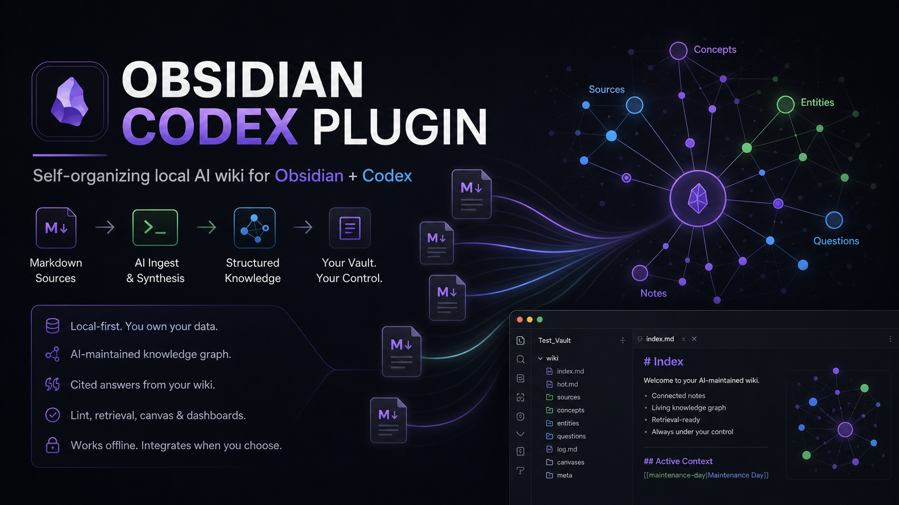
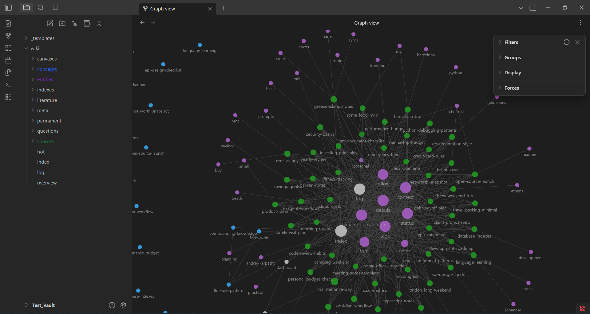

# Obsidian Codex Plugin



This vault is designed for real note-taking: capture first, organize later.

You can throw rough thoughts into `wiki/hot.md`, store old notes and pasted material in `wiki/sources/`, and gradually turn the useful pieces into literature notes, permanent notes, and topic indexes. The goal is not to make you perfectly categorize every idea upfront. The goal is to give messy thinking a place to land, then help it become durable knowledge over time.

> Educational project notice: this project is experimental software for learning, research, and personal knowledge-management workflows. It is provided as-is under Apache-2.0. You are responsible for how you use it, the notes you ingest, and any decisions you make from generated wiki content.

## Capture First, Organize Later

Use the vault like a lightweight thinking workflow, not a filing bureaucracy:

1. Capture anything quickly in `wiki/hot.md`.
   Write random thoughts, rough notes, reminders, ideas, and unfinished fragments without stopping to decide where they belong.
2. Preserve old or messy material in `wiki/sources/`.
   Drop in old notes, copied documents, research dumps, or unprocessed material so the vault becomes useful immediately.
3. Process notes gradually.
   Move notes from books, videos, articles, podcasts, research, or conversations into `wiki/literature/`. Distill long-term insights and personal ideas into `wiki/permanent/`.
4. Build maps of knowledge in `wiki/indexes/`.
   Create topic maps and navigation pages for areas like AI, health, business ideas, projects, or anything else you want to think about over time.

The folders are not rules. They are a lightweight path from fast capture to organized knowledge.

## Demo

After ingesting 50 mixed sample Markdown files, Obsidian graph view starts to show a linked working-memory layer:



## Why This Exists

Large language model sessions are powerful, but they forget context unless you give them a durable place to write. Obsidian is a natural home for that context because it is local-first, Markdown-based, graph-friendly, and pleasant to inspect manually.

This clean-room Codex-native plugin helps Codex act like a wiki maintainer:

- `wiki/hot.md` stores the latest working context and scratchpad material.
- `wiki/sources/` preserves raw, old, pasted, or unprocessed material.
- `wiki/literature/`, `wiki/permanent/`, and `wiki/indexes/` support the zettelkasten path from source notes to durable ideas and topic maps.
- Other modes can also create folders such as `wiki/concepts/`, `wiki/entities/`, `wiki/questions/`, `wiki/maps/`, or PARA folders.
- `.raw/` tracks ingested source files when Codex imports external Markdown.
- `.vault-meta/retrieval-index.json` helps Codex find relevant pages before answering.

The result is not just a pile of Markdown. It is a local knowledge graph that can start messy, become more organized over time, and remain readable in Obsidian.

## Inspiration And Attribution

This project is inspired by the public LLM wiki workflow and the MIT-licensed [`AgriciDaniel/claude-obsidian`](https://github.com/AgriciDaniel/claude-obsidian) project.

This repository is a clean-room Codex-native implementation:

- It does not copy upstream GPL CSS snippets.
- It does not bundle Obsidian community plugin binaries.
- It uses filesystem-first helpers designed for Codex plugin workflows.
- Optional REST, MCP, and Obsidian CLI transport detection is metadata only unless explicitly used.

## What It Does

- Sets up a ready-to-open Obsidian vault.
- Leads naturally with `zettelkasten` mode while still supporting `generic`, `lyt`, and `para` modes.
- Ingests Markdown/text sources into linked wiki pages.
- Builds a lightweight retrieval index for cited answers.
- Lints the vault for dead links, missing frontmatter, orphans, duplicate titles, weak source attribution, and stale hot cache.
- Saves conversations into the wiki.
- Creates Obsidian canvas files and dashboard metadata.
- Preserves existing vault notes when bootstrapping into an existing vault.

## Quick Start

### 1. Install the Codex plugin locally

From the plugin source folder:

```powershell
codex plugin add obsidian-codex-plugin@personal
```

Start a new Codex thread after installing or refreshing the plugin so the skills are loaded.

### 2. Set up a test vault

Ask Codex:

```text
Set up an Obsidian wiki vault at C:\path\to\Test_Vault using zettelkasten mode.
```

Or run the helper directly:

```powershell
.\bin\setup-vault.ps1 C:\path\to\Test_Vault zettelkasten
```

### 3. Open the vault in Obsidian

In Obsidian:

```text
Manage vaults -> Open folder as vault
```

Open:

```text
C:\path\to\Test_Vault
```

### 4. Ingest sample Markdown files

Ask Codex:

```text
Ingest all Markdown files from C:\path\to\Test_Data into my Obsidian wiki at C:\path\to\Test_Vault.
```

After ingesting 50 files, a healthy test vault should look roughly like:

```text
wiki/sources: 50 source pages
.raw/.manifest.json: 50 tracked source entries
retrieval index: refreshed
zettelkasten folders: wiki/literature, wiki/permanent, wiki/indexes
lint: no blocker/high/medium/low findings
hot cache: points to the latest ingest
```

## Example Codex Prompts

Query the wiki with citations:

```text
Query my Obsidian wiki at C:\path\to\Test_Vault about finance themes with citations.
```

Find cross-topic connections:

```text
Find connections between travel planning, budgeting, and personal routines in my wiki.
```

Create a visual canvas:

```text
Create a canvas called Test Data Map grouping the ingested notes into development, travel, finance, and personal life.
```

Save a useful conversation:

```text
Save this conversation to my Obsidian wiki as "Plugin Launch Notes".
```

Run a health check:

```text
Lint my Obsidian wiki at C:\path\to\Test_Vault and tell me what needs cleanup.
```

Plan research:

```text
Run autoresearch on "local-first AI knowledge bases" and file the research plan in my wiki.
```

## Vault Shape

```text
vault/
|-- .raw/
|   `-- .manifest.json
|-- .vault-meta/
|   |-- mode.json
|   |-- retrieval-index.json
|   `-- transport.json
|-- wiki/
|   |-- index.md
|   |-- log.md
|   |-- hot.md
|   |-- overview.md
|   |-- sources/
|   |-- literature/
|   |-- permanent/
|   |-- indexes/
|   |-- entities/
|   |-- concepts/
|   |-- questions/
|   |-- canvases/
|   `-- meta/
|       |-- dashboard.base
|       `-- dashboard.md
|-- _templates/
`-- .obsidian/
```

In zettelkasten mode, `wiki/hot.md`, `wiki/sources/`, `wiki/literature/`, `wiki/permanent/`, and `wiki/indexes/` form the main user workflow. The plugin also supports `generic`, `lyt`, and `para` modes, which may add or emphasize other folders such as `wiki/concepts/`, `wiki/entities/`, `wiki/questions/`, `wiki/maps/`, `wiki/projects/`, `wiki/areas/`, `wiki/resources/`, and `wiki/archive/`.

`.raw/` is treated as source storage for ingested files. Codex writes maintained wiki notes under `wiki/`.

## Helper Scripts

```powershell
python scripts\setup_vault.py C:\path\to\vault --mode generic
python scripts\detect_vault.py C:\path\to\vault --create
python scripts\ingest_source.py C:\path\to\vault C:\path\to\vault\.raw\example.md
python scripts\retrieve.py C:\path\to\vault --query "topic" --json
python scripts\lint_wiki.py C:\path\to\vault --json
python scripts\save_note.py C:\path\to\vault "Thread title" --content "Saved context"
python scripts\autoresearch.py C:\path\to\vault "Research topic"
python scripts\canvas.py C:\path\to\vault --name main --add-text "Welcome"
python scripts\mode.py C:\path\to\vault --mode zettelkasten
python scripts\transport.py C:\path\to\vault --json
python scripts\dashboard.py C:\path\to\vault --json
```

## Real-Life Workflow

1. Capture rough thoughts in `wiki/hot.md` whenever you need a fast place to write.
2. Put old notes, exported docs, copied Markdown, and unprocessed material in `wiki/sources/`.
3. Ask Codex to set up or detect your Obsidian wiki vault and ingest source folders when useful.
4. Gradually move useful material into `wiki/literature/`, `wiki/permanent/`, and `wiki/indexes/`.
5. Open Obsidian to inspect the generated graph, folders, and links.
6. Ask Codex questions against the wiki, lint the vault, and save important conversations.

Obsidian remains the place you browse, edit, and visualize. Codex becomes the assistant that files, links, retrieves, and audits.

## Limitations

- Generated notes are drafts. Review important content before relying on it.
- Entity and concept extraction is deterministic and intentionally simple.
- This is not financial, legal, medical, travel, or professional advice.
- Optional REST/MCP/Obsidian CLI transports are detected but not required.
- The plugin does not replace backups, source control, or careful review.

## Verification

```powershell
python -m unittest discover -s tests -v
$files = Get-ChildItem scripts -Filter *.py | ForEach-Object { $_.FullName }; python -m py_compile @files
python %USERPROFILE%\.codex\skills\.system\plugin-creator\scripts\validate_plugin.py C:\path\to\obsidian-codex-plugin
```

Current local verification includes:

```text
19 unit tests passing
plugin validation passing
installed-cache smoke test passing
50-file sample ingest passing
vault lint clean after ingest
```

## License

Apache License 2.0. See `LICENSE`.
